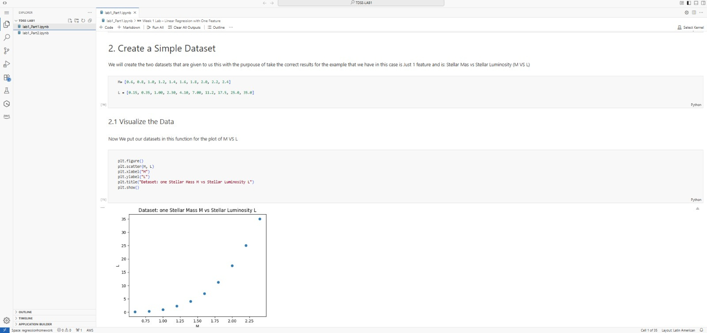
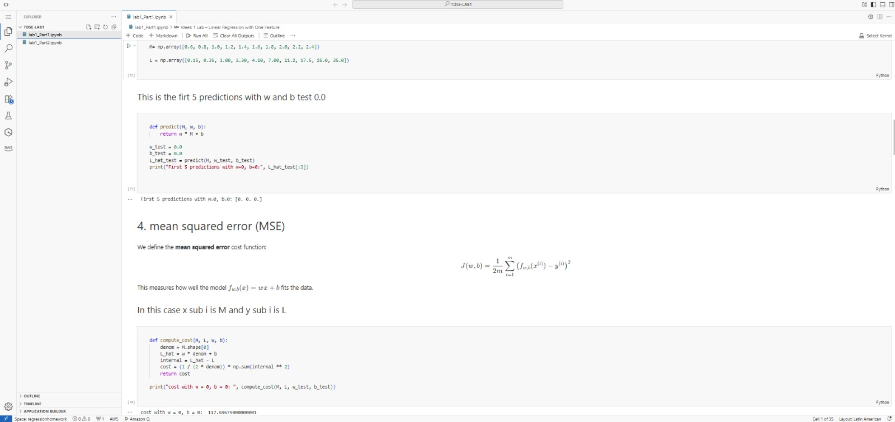
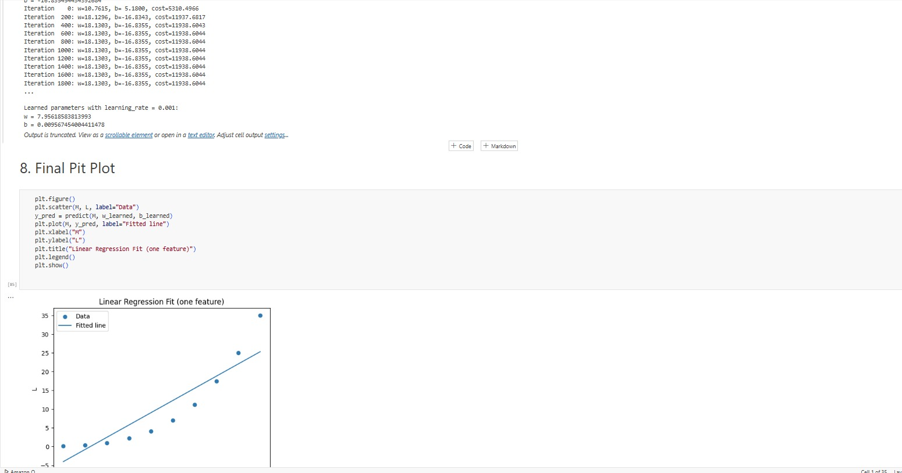
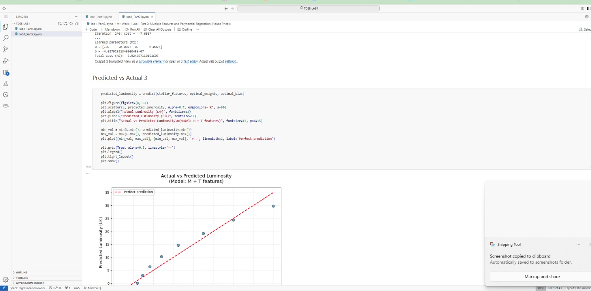

# TDSE LAB1 Manuel Alejandro Guarnizo

A practical repository for implementing regression techniques on astronomical data. This project explores both linear and polynomial approaches to model stellar mass-luminosity relationships.


## In this repository are the notebooks:
Lab1_Part1(one feature) and Lab1_Part2(Multiple features)
## Project Overview
This repository contains two Jupyter Notebooks that demonstrate:
- **Linear regression** with a single feature and with multiple features

## Setup Instructions

### Requirements
- **Python 3.10+** (compatible with most Python 3.x versions)
- **Jupyter Notebook** or **JupyterLab**
- Python libraries: `numpy`, `matplotlib`, `scikit-learn`, `pandas`

### Installation Steps
1. Clone the repository:
   ```bash
   git clone <repository-url>


## SAGEMAKER Evidence













